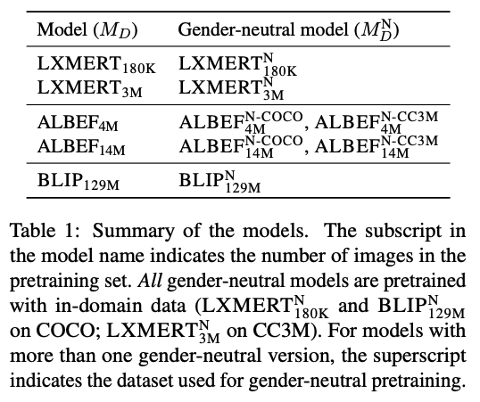

# Evaluating Bias and Fairness in Gender-Neutral Pretrained Vision-and-Language Models

This is the code to replicate the experiments described in the paper (to appear in EMNLP23):
>Laura Cabello, Emanuele Bugliarello, Stephanie Brandl and Desmond Elliott. Evaluating Bias and Fairness in Gender-Neutral Pretrained Vision-and-Language Models. _To appear in EMNLP 2023._

## Repository Setup

You can clone this repository issuing: <br>
`git clone git@github.com:coastalcph/gender-neutral-vl.git`

1\. Create a conda environment and install all dependencies.

1.1. Option A) Create a fresh conda environment and use pip
```text
conda create -n gneutralvl python=3.9
conda activate gneutralvl
pip install -r requirements.txt
```

1.2. Option B) You can directly create a conda environment with all dependencies installed as:
```text
conda create -n gneutralvl --file conda_requirements.txt python=3.9
```

2\. Install PyTorch (only needed if you chose Option A) in step 1).
```text
conda install pytorch=1.12.0=py3.9_cuda11.3_cudnn8.3.2_0 torchvision=0.13.0=py39_cu113 cudatoolkit=11.3 -c pytorch
```

Following steps are required in order to run code from [VOLTA](https://github.com/e-bug/volta/tree/main):

3\. Install [apex](https://github.com/NVIDIA/apex).
If you use a cluster, you may want to first run commands like the following:
```text
module load cuda/10.1.105
module load gcc/8.3.0-cuda
```

4\. Setup the `refer` submodule for Referring Expression Comprehension:
```
cd tools/refer; make
```

5\. Install this codebase as a package in this environment.
```text
python setup.py develop
```

## Data

tbd

## Models
Check out [`MODELS.md`](MODELS.md) for links to pretrained models and gender-neutral pretrained models.

Model configuration depend on the model family. Files are stored in:

* LXMERT: [src/LXMERT/volta/config/](src/LXMERT/volta/config/)
* ALBEF: [src/ALBEF/configs/](src/ALBEF/configs)
* BLIP: [src/BLIP/configs/](src/BLIP/configs)

## Training and Evaluation

We provide bash scripts to train (i.e. continued pretraining or fine-tuning) and evaluate models in [experiments/](experiments).
These include the following models, as specified in our experimental setup (Section 5):




Task configuration files are stored in:

* LXMERT: [src/LXMERT/volta/config_tasks/](src/LXMERT/volta/config_tasks/)
* ALBEF: [src/ALBEF/configs/](src/ALBEF/configs)
* BLIP: [src/BLIP/configs/](src/BLIP/configs)


Code to plot results is shared in Jupyter Notebooks in [notebooks/](notebooks).


## License 

This work is licensed under the MIT license. See [`LICENSE`](LICENSE) for details. 
Third-party software and data sets are subject to their respective licenses. <br>
If you find our code/data/models or ideas useful in your research, please consider citing the paper:
```
(to be updated)
```

